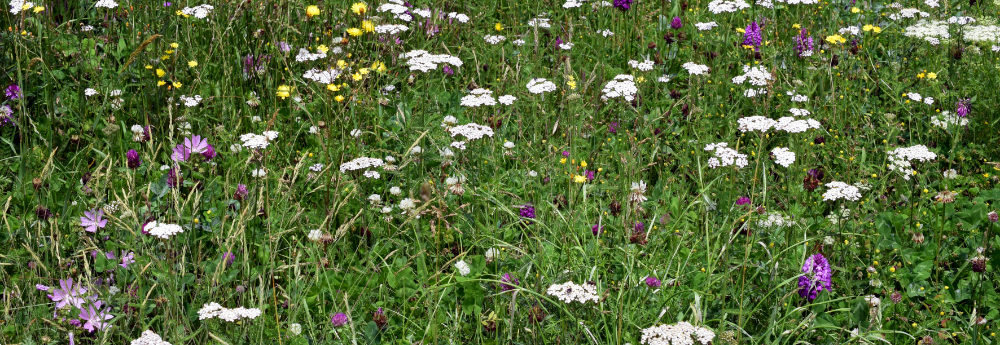

README.md
================

# Seed ecology of European mesic meadows

This repository stores all the information related to the manuscript
[*Seed ecology of European mesic
meadows*](https://dx.doi.org/10.1093/aob/mcab135), including the raw
datasets, the scripts to perform data cleaning and analysis, and the
`Rmarkdown` files to create the manuscript.

## Contents

This repository is organised following the advice of [Wilson et
al. 2017](https://doi.org/10.1371/journal.pcbi.1005510) for recording
and storing research projects.

The following materials are available in the folders of this repository:

  - `data` Data files including the
    [European](https://github.com/efernandezpascual/meadows/blob/master/data/european.csv),
    [Iberian](https://github.com/efernandezpascual/meadows/blob/master/data/iberian.csv)
    and
    [Cantabrian](https://github.com/efernandezpascual/meadows/blob/master/data/cantabrian.csv)
    datasets; the [seed
    morphometrics](https://github.com/efernandezpascual/meadows/blob/master/data/morphometrics.csv)
    and the [phylogenetic
    tree](https://github.com/efernandezpascual/meadows/blob/master/data/meadowstree.tree).
  - `doc` Files to create the
    [manuscript](https://github.com/efernandezpascual/meadows/blob/master/doc/manuscript.md)
    using `Rmarkdown`.
  - `results` Output of the `R` scripts, including figures and models.
  - `src` Scripts in `R` language used to clean the raw data and perform
    the analyses of the manuscript.

## Abstract

  - **Background and Aims** European mesic meadows are semi-natural open
    habitats of high biodiversity and an essential part of European
    landscapes. These species-rich communities can be a source of seed
    mixes for ecological restoration, urban greening and rewilding.
    However, limited knowledge of species germination traits is a
    bottleneck to the development of a competitive native seed industry.
    Here, we synthesize the seed ecology of mesic meadows.
  - **Methods** We combined our own experimental data with data obtained
    from databases to create a combined dataset containing 2,005
    germination records of 90 plant species from 31 European countries.
    We performed a Bayesian meta-analysis of this dataset to test the
    seed germination response to environmental cues including
    scarification, stratification, temperature, alternating temperature
    and light. We also used multivariate ordination to check the
    relationship between seed traits (germination and morphology) and
    species ecological preferences, and to compare the seed ecology of
    mesic meadows with that of other herbaceous plant communities from
    the same area.
  - **Key Results** The seed ecology of mesic meadows is characterized
    by (1) high seed germinability when compared to other herbaceous
    plant communities; (2) low correspondence between seed traits and
    species ecological preferences; and (3) a deep phylogenetic
    separation between the two major families, Poaceae and Fabaceae.
    Poaceae produce many light seeds which respond to gap-detecting
    germination cues (alternating temperatures and light); Fabaceae
    produce fewer heavy seeds, which need scarification to break their
    physical dormancy.
  - **Conclusions** High germinability of meadow seeds will reduce their
    capacity to form persistent seed banks, resulting in dispersal
    limitations to passive regeneration. For centuries, human activities
    have shaped the regeneration of meadows, leading to a loss of seed
    dormancy and decoupling seeds from seasonal cycles, as has been
    found in many domesticated species. The same anthropic processes
    that have shaped semi-natural mesic meadows have left them dependent
    on continued human intervention for their regeneration, highlighting
    the importance of active restoration via seed supply.

## Citation

Please cite the repository, datasets and article as:

> Fernández-Pascual E, Vaz M, Morais B, Reiné R, Ascaso J, Afif Khouri
> E, Carta A. [Seed germination ecology of European mesic
> meadows.](https://dx.doi.org/10.1093/aob/mcab135) *Annals of Botany*,
> in press.
