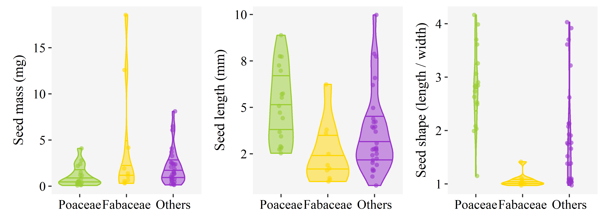
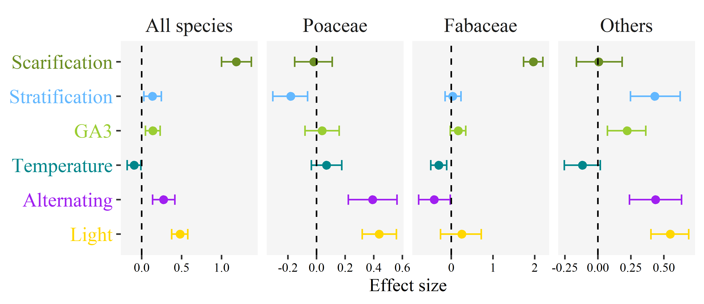
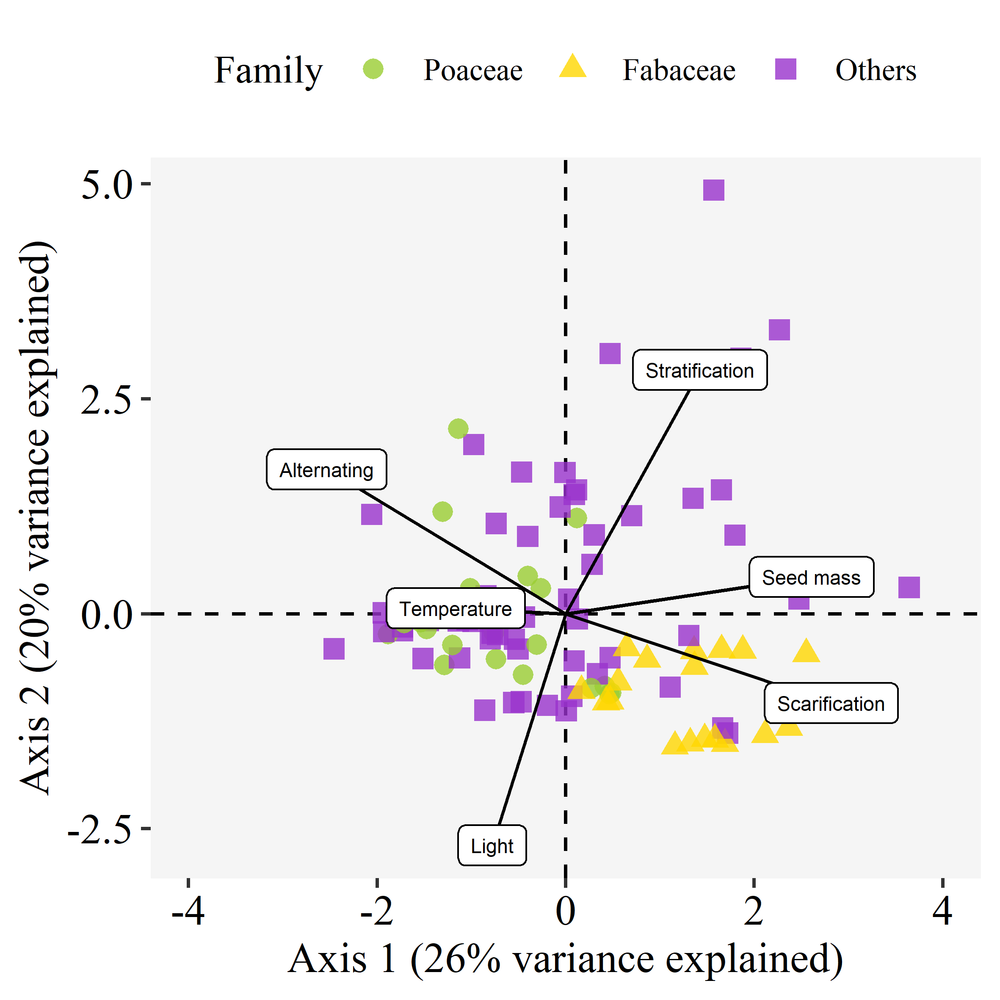

```{r setup, include=FALSE}
knitr::opts_chunk$set(echo = TRUE)
```

```{r message = FALSE, echo = FALSE, warning = FALSE}
library(tidyverse)
source("../src/numbers.R")
```

```{r message = FALSE, echo = FALSE, warning = FALSE}
knitr::knit_hooks$set(inline = function(x) {
  prettyNum(x, big.mark = ",")
})
```

Eduardo Fernández-Pascual^1^ ^+^, Elías Afif Khouri^1^, Joaquín Ascaso^2^, Beatriz Morais^1^, Ramón Reiné^2^, Madalena Vaz^3^ 
 
^1^ Departamento de Biología de Organismos y Sistemas, Universidad de Oviedo, Oviedo/Uviéu, Spain; ^2^ Departamento de Ciencias Agrarias y Medio Natural, Universidad de Zaragoza, Huesca, Spain; ^3^ Banco Português de Germoplasma Vegetal, Instituto Nacional de Investigação Agrária e Veterinária (INIAV), Braga, Portugal

^+^ Correspondence: Departamento de Biología de Organismos y Sistemas, Universidad de Oviedo, C/ Catedrático Rodrigo Uría, 33006 Oviedo/Uviéu, Spain. Email: efernandezpascual@gmail.com. Telephone: +34985104787.

# Abstract

# Keywords

*Arrhenatherion*, plant regeneration, seed germination, seed morphology

# Introduction

Iberian hay meadows [@RN2980] are seminatural grassland communities which developed in clearings of a formerly wooded landscape. They are species-rich mesophilous habitats, rarely fertilized, and occupy deep soils from clays to sands.  Mowing for haymaking thus is a predictable perturbation that occurs approximately at the same time every year, and which is expected to contribute to the high diversity of this habitats [@RN4887; @RN4888]. Hay meadow plants must establish, grow and reproduce in the time frame determined by this perturbation, and we can expect that seed morphology and germination timing will play a functional role in community assembly. 

# Materials and methods

## Selection of study species

To select species for inclusion in our analysis, we used a dataset of 118 vegetation plots from three Iberian regions with well-maintained mesic grasslands: 43 plots from Northern Portugal (Trás-os-Montes), 25 from the Cantabrian Mountains of Spain (Parque Nacional Picos de Europa) and 50 from the Spanish Pyrenees (Aragón). The dataset contains a relatively high diversity of mesic grassland species, as the plots were situated along a major stress gradient related to drought [@RN2980]: two Spanish regions with a Temperate macroclimate, and Northern Portugal which is transitional between the Temperate and Mediterranean macroclimates [@RN4893]. Furthermore, grasslands from the Pyrenees are closest to the central European optimum of mesic grassland vegetation (*Arrhenatheretalia elatioris* Tx. 1931) while Portuguese grasslands are in suboptimal areas at the limit of the distribution [@RN4893]. 

Each plot was square (25-100 m^2 area) and was situated in the central part of a meadow avoiding the margins. The chosen meadows are maintained by traditional agricultural practices (mowing for hay-making once or twice per year). Vegetation in the plots was sampled in 2016-2017, at the peak of plant development, just before mowing. All vascular plant species in the plots were recorded and assigned an abundance value using the transformation of the Braun-Blanquet scale to coverage (+ = 0.1%, 1 = 5%, 2 = 17.5%, 3 = 37.5%, 4 = 62.5% and 5 = 87.5%). All plant names in this manuscript follow the nomenclature of the Euro+Med plant database (https://www.emplantbase.org/home.html). Using all the plots, we calculated the cumulative abundance of each species in the entire area. We removed 208 species with cumulative abundance values below 2%, considering them transient species that might have been recorded by chance and do not represent the core mesic grasslands flora. We used the remaining 117 species as the core list to retrieve seed germination data for this article.

## Species collection and morphology

From the vegetation plots described above, we collected dispersal units (hereafter called seeds) during the dispersal seasons of 2016-2018. To describe seed morphology, we acquired images of 100-seed samples of each species using a flatbed scanner (Brother LC985) with a resolution of 200 dpi and a scanning area of 1024 x 1024 pixels [@RN2678]. We distributed the seeds on the scanner transparent glass, in a 10 x 10 grid. For each sample, and without moving the seeds, we repeated the scans with black and white backgrounds. In the case of the black background, we covered samples with a black box to avoid interference from environmental light. For the white background, we used the scanner cover. We digitized the obtained images and stored them in JPEG format (Joint Photographic Experts Group). We processed the scanned images using *ImageJ*, an open-source image processing program designed for scientific multidimensional images [@RN4708]. The program calculates several biometric parameters for each seed on the sample, among these, seed length and width. Using these values, we calculated seed shape as seed length divided by seed width. Additionally, we obtained seed mass for the study species from Kew's Seed Information Database [@RN2987].

## Seed germination data

To describe seed germination requirements, we germinated seeds of the different species following a protocol that accounts for the effect of germination temperature as a main physiological driver of germination phenology [@RN2249]. We used three germination treatments to determine the effect of temperatures representative for the study area: 14/4 ºC representing the capacity of freshly-dispersed seeds to germinate at cool temperatures of spring and autumn, 22/12 ºC as the optimal summer temperature, and 30/20 ºC as sun-heated soil, e.g. soil exposed to sun after hay cutting. Additionally, we compared, at each of these temperature regimes, the germination of fresh seeds versus seeds subjected to a dormancy-breaking treatment. In the case of the Fabaceae, the treatment consisted in scarification by chipping the seed coat with a scalpel, to remove physical dormancy [@RN3214]. For the rest of the families, we used an incubation in gibberellic acid GA~3~ (0,0645 mM) in darkness during 24h, as a treatment to remove any potential physiological seed dormancy [@RN4976]. For each species and treatment, we sowed four Petri dishes with 25 seeds each. The germination substrate was 1% distilled water - agar. We sealed dishes with Parafilm to prevent desiccation. Trials took place in a germination chamber (KBW 400, Binder GmbH, Tuttlingen, Germany) with a 12/12 hour photoperiod (the light period corresponding to the higher temperature). Experiments lasted for four weeks, with germination scoring once per week. The germination criterion was 2 mm radicle emergence. After four weeks, we cut the seeds that failed to germinate and examined them under a magnifying glass. We classified them as normal when the embryo was visible and firm, empty when they lacked an embryo, and contaminated when they were moldy. We only considered normal seeds to calculate germination proportions and conduct subsequent analyses.

In addition to this experimental data, we retrieved seed germination records from ENSCOBASE, the seed germination database of the European Native Seed Conservation Network (http://enscobase.maich.gr/index.tml); and the *SylvanSeeds* database of seed germination records for nemoral biome species [@RN4968]. The combined dataset, including our own experimental data and the records from ENSCOBASE, contained `r MSrecords` records (i.e. germination proportions for a given seed lot of a species, recorded in a set of laboratory experimental conditions). There were `r MSspecies` species in the dataset. Overall, `r MSseeds` seeds had been used in the experiments. The range of experimental germination temperatures (weighted average of the daily thermoperiod) which had been used in the experiments went from `r MSminT` to `r MSmaxT` ºC, with `r MSaltN` records of constant temperatures (i.e. experiments that used the same temperature during all their duration) and `r MSaltY` of alternating temperatures (i.e. experiments where different temperatures were applied during the day and the night, in diurnal cycles). Seeds had been exposed to light during some part of the diurnal cycle in `r MSlightY` records and kept in total darkness in `r MSlightN` records. Experiments had been performed with unstratified seeds (i.e. not subjected to a previous dormancy-breaking incubation) in `r MSstratN` records and with stratified seeds (i.e. subjected to previous incubation in dormancy-breaking conditions, including treatments of wet incubation under cold, warm and combinations of cold and warm conditions) in `r MSstratY` records. Finally, there were `r MSgaY` records where GA~3~ had been applied, and `r MSscarY` records where seeds had been scarified.

## Statistical analysis

To test the effect of the germination treatments on seed germination proportions, we performed a meta-analysis of the germination dataset by fitting binomial generalized mixed models with Bayesian estimation (Markov Chain Monte Carlo generalized linear mixed models, MCMCglmms) using the R package *MCMCglmm* [@RN4755]. We fitted the analysis separately for the three major groups of mesic grassland plants: Poaceae, Fabaceae, and the minor families. To account for the effect of a shared phylogeny in species traits, models included as a random effect a reconstructed phylogenetic tree for the study species. To create the phylogeny we used the R package *V.PhyloMaker* [@RN4753] which contains an updated mega-tree of the seed plants based on Smith & Brown [-@RN4754]. We placed taxa absent from the mega-tree at the genus-level basal node. The phylogenetic tree is available in the data folder of the GitHub repository (see Data Availability Statement). Germination proportion was the response variable. Models had, as fixed effects, the experimental conditions (scarification, stratification, GA~3~, temperature, alternating temperature and light). Random effects included the phylogenetic tree, species identity, seed lot and source of the data. In all models, response variables were scaled so their contribution to the effect sizes could be compared. We used weakly informative priors in all models, with parameter-expanded priors for the random effects. Each model was run for 500,000 MCMC steps, with an initial burn-in phase of 50,000 and a thinning interval of 50 [@RN4756], resulting, on average, in 9,000 posterior distributions. From the resulting posterior distributions, we calculated mean parameter estimates and 95% Highest Posterior Density (HPD) and Credible Intervals (CI). We estimated the significance of model parameters by examining CIs, considering parameters with CIs overlapping with zero as non-significant. To estimate the phylogenetic signal of seed germination over all variables, we used Pagels’s lambda (λ) [@RN4757], estimated simultaneously with the models by calculating the mean of the posterior distribution and the 95% CI of λ as indicated by De Villemereuil et al. [-@RN4756]. When λ = 0, related taxa are no more similar than expected by chance, while when λ = 1, the trait is evolving following a constant variance random walk or Brownian motion model; intermediate values of λ indicate a phylogenetic correlation in trait evolution that does not fully follow a Brownian motion model [@RN4757]. Detailed results of the MCMCglmms are available in the results folder of the GitHub repository (see Data Availability Statement).

To visualize the main patterns in the seed germination spectrum of mesic grassland plants, we did a Principal Component Analysis (PCA) as implemented in the package *FactoMineR* [@RN3166]. We performed the PCA ordination at the species level, i.e. calculating a series of continuous traits for each species. We transformed the final germination proportions to create a continuous variable for the germination cues (i.e. stratification, scarification, temperature, alternating temperatures and light). To do so, for each cue and species, we calculated a weighted average of the cue levels (in the case of temperature, cue levels were the temperature treatments; for the other cues the levels were 0 = absence and 1 = presence), weighting by the germination proportion at each level. This approach underrepresents the importance of the levels that were not tested for a given species, but can serve as a proxy of the response to the germination cues when visualized across the whole dataset; it must be stressed that this stage of the analysis serves only for visualization and not for hypothesis testing. We also included seed mass in the ordination. We left GA~3~ out of the PCA because its ecological interpretation is subordinated to stratification (as both cues break physiological seed dormancy). We also left seed length, width and shape out because these values were not available for all species.

# Results

## Seed morphology

The dispersal unit in the dominant grass family (Poaceae) is generally the floret (**Fig. 1a**), a composite structure made up of the caryopsis (a dry, indehiscent and monospermic fruit) and several surrounding bracts (i.e. modified leaves): the lemma, the palea and, in many species, two glumes. This structure is often accompanied by awns or hairs that aid in dispersal (**Fig. 1b**). The mass of these dispersal units in grassland grasses ranges from `r MSpoaMin` to `r MSpoaMax` mg, and they tend to be longer (`r MSpoaLength` mm on average) than they are wide (`r MSpoaWidth` mm). In the subordinate family of the legumes (Fabaceae), the dispersal unit of most species is the seed itself (**Fig. 1c**). Fabaceae generally are hard-seeded, i.e. they have a water-impermeable seed coat which needs to become permeable before germination can happen (i.e. physical seed dormancy). In some Fabaceae, dispersal units are more complex, including indehiscent monospermic fruits (e.g. *Onobrychis*, **Fig. 1d**) or indehiscent monospermic fruit fragments, i.e. loments (e.g. *Ornithopus*, **Fig. 1e**). In mesic grasslands, the dispersal units of the Fabaceae are generally heavier than those of the Poaceae, ranging from `r MSlegMin` to `r MSlegMax` mg; and they are also rounder (`r MSlegLength` mm long vs. `r MSlegWidth` mm wide). In many of the most frequent minor families, such as the Asteraceae, the Ranunculaceae, the Lamiaceae and the Dipsacaceae, the dispersal unit is the achene, i.e. a dry, indehiscent and monospermic fruit. The achenes of the grassland Asteraceae tend to be cypselas, wearing a pappus that aids in dispersal by wind (**Fig. 1f**). In the Ranunculaceae, the achenes are usually flattened and sometimes beaked (**Fig. 1g**). The achenes of the Lamiaceae are hardened nutlets (**Fig. 1h**). In the genus *Knautia* (Dipsacaceae), the achene is covered by hairs (**Fig. 1i**). In the Cyperaceae, the dispersal unit is an achene surrounded by a perigynium which aids in dispersal by water (**Fig. 1j**). In the genus *Sanguisorba* (Rosaceae), the dispersal unit is the urn-shaped receptacle containing one to three achenes (**Fig. 1k**). The dispersal unit of the Apiaceae is the mericarp (**Fig. 1l**), an indehiscent monospermic fragment of the fruit. In some other minor families the dispersal unit is the seed itself, such as in the Caryophyllaceae (**Fig. 1m**) or the Plantaginaceae (**Fig. 1n**). The hemiparasitic species of *Rhinanthus* (Orobanchaceae) disperse by winged seeds (**Fig. 1ñ**). When comparing the morphology of all species (**Fig. 2**), the Poaceae appear as having relatively lighter and more elongated dispersal units, in contrast with the Fabaceae, which tend to have rounder and heavier seeds.

## Germination responses

When considering the full set of mesic grassland species, all of the six studied germination cues had a significant effect on final germination proportions (**Fig. 3**). The germination of grassland seeds was increased by scarification, stratification, GA~3~, alternating temperatures, and light. Temperature had a negative effect, indicating a trend towards higher germination at lower temperatures. Averaging the whole dataset, the highest germination proportions were achieved at 20ºC. Between 0ºC and 20ºC, germination proportions increased steadily with increasing temperatures. Above 20ºC, germination declined more sharply, and grassland seeds rarely germinated at 30ºC.

Some differences became apparent when dividing the dataset in the major floristic groups that compose mesic grassland vegetation. In the dominant group of the Poaceae (**Fig. 3**), no effect was found for stratification, GA~3~ or temperature. Stratification had a negative effect on germination. The major drivers of Poaceae germination appeared to be alternating temperatures and light, with both having a positive effect. In the subordinate group of the Fabaceae (**Fig. 3**), the largest positive effect on germination was produced by scarification, with no effect of stratification, GA~3~ or light. Temperature had a negative effect, and in fact Fabaceae species had higher germination proportion at temperatures under 20ºC than Poaceae species did. Fabaceae seed germination also responded negatively to alternating temperatures. Finally, for the group of the minor families (**Fig. 3**), the main cues having a positive effect on germination were stratification, GA~3~. alternating temperatures and light. These species did not respond to scarification nor to temperature.

To describe the effects of the random factors, we will refer only to the full model that included all species in the dataset. The strongest effect was that of the phylogeny (mean = `r MSphylo`, CI = `r MSphylol` - `r MSphyloh`), followed by the source of the data (mean = `r MSsource`, CI = `r MSsourcel` - `r MSsourceh`), the seed lot (mean = `r MSpopulation`, CI = `r MSpopulationl` - `r MSpopulationh`), and species identity (mean = `r MSspecies`, CI = `r MSspeciesl` - `r MSspeciesh`). The phylogenetic signal in the germination responses was relatively high (lambda = `r MSlambda`, CI = `r MSlambdal` - `r MSlambdah`).

## Seed germination spectrum

The first PCA axis explained `r round(pca$eig[1, 2], 0)`% of the variation (**Fig. 4**). The variables with the largest contribution to this first axis were the germination responses to scarification and alternating temperatures, and seed mass. This horizontal axis separated (i, left) species of the Poaceae and the minor families which responded to alternating temperatures and had smaller seeds from (ii, right) species of the Fabaceae which responded to scarification and had heavier seeds. Axis 2 explained `r round(pca$eig[2, 2], 0)`% of the variability. The main contributing variables were the germination responses to light and stratification. This axis separated (iii, bottom) species from all groups that germinated better in light from (iv, top) species of the minor families which needed stratification to germinate and had higher germination in the dark.

# Discussion

# Acknowledgements

E.F.P. received financial support from the Government of Asturias and the FP7 – Marie Curie - COFUND programme of the European Commission (Grant ‘Clarín’ ACB17-19). This research was supported by project Interreg SUDOE “SOS PRADERAS” SOE1/P5/E037 (https://www.sospraderas.eu/en/).

# Author contributions

E.F.P. conceived the study, performed the analyses and wrote the manuscript. All authors contributed data, revised the manuscript, and approved the final version.

# Data availability

The original data, R code for the analysis and creation of the manuscript can be accessed at the GitHub repository https://github.com/efernandezpascual/meadows. Upon publication, a version of record of the repository will be deposited in Zenodo.

# References

::: {#refs}
:::

# Figures

```{r fig1, echo = FALSE, fig.pos = "H", fig.cap = "Diversity of dispersal units in mesic grasslands: (a) Floret of *Cynosurus cristatus* (Poaceae); (b) floret of *Arrhenatherum elatius* (Poaceae); (c) seed of *Lathyrus pratensis* (Fabaceae); (d) legume of *Onobrychis viciifolia* (Fabaceae); (e) loment fragment of *Ornithopus perpusillus* (Fabaceae); (f) achene with pappus of *Centaurea scabiosa* (Asteraceae); (g) achene of *Ranunculus acris* subsp. *despectus* (Ranunculaceae); (h) nutlet of *Prunella grandiflora* (Lamiaceae); (i) achene of *Knautia nevadencis* (Dipsacaceae); (j) perigynium of *Carex binervis* (Cyperaceae); (k) receptacle of *Sanguisorba minor* (Rosaceae); (l) mericarp of *Carum verticillatum* (Apiaceae); (m) seed of *Cerastium fontanum* (Caryophyllaceae); (n) seed of *Plantago lanceolata* (Plantaginaceae); (ñ) seed of *Rhinanthus angustifolius* (Orobanchaceae)."}
knitr::include_graphics("../results/figures/seeds.png")
```

```{r fig2, echo = FALSE, fig.pos = "H", fig.cap = "Seed size and shape in mesic grasslands. Kernel probability densities (violin plots) for seed mass, seed length and seed shape (length / width).  The three horizontal lines within the probability densities represent the first quartile, the median and the third quartile of the data."}

```

```{r fig3, echo = FALSE, fig.pos = "H", fig.cap = "Effect of the germination environment on seed germination of mesic grassland species. Dots indicate the posterior mean of the effect size, and whiskers its 95 % credible interval. The line of zero effect is shown. When the credible intervals overlap with the zero-effect line, the effect is not significant. The figure shows the results of a model including all species, and of models including only the three main floristic groups of mesic grasslands"}

```

```{r fig4, echo = FALSE, fig.pos = "H", fig.cap = "Principal Component Analysis ordination of the seed germination spectrum of mesic grassland species. Each symbol is a species, different symbols indicate the three major floristic groups of mesic grasslands Labels indicate the contribution of the variables to the axes."}

```