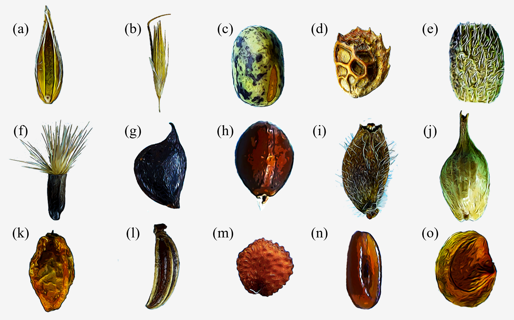
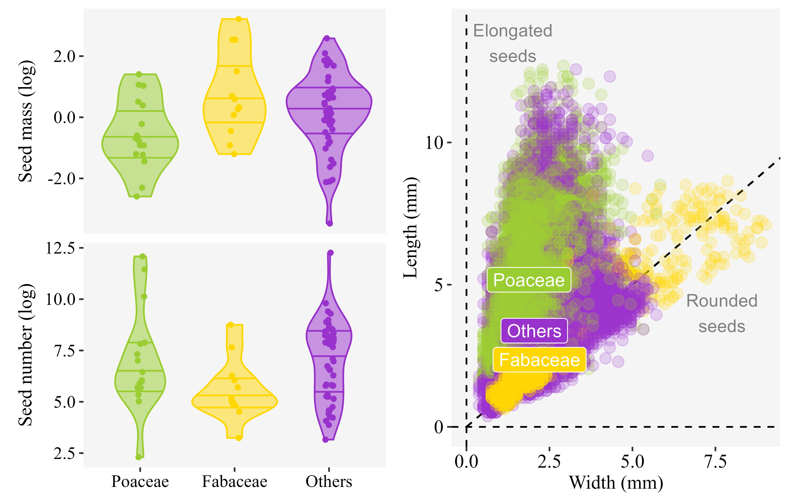
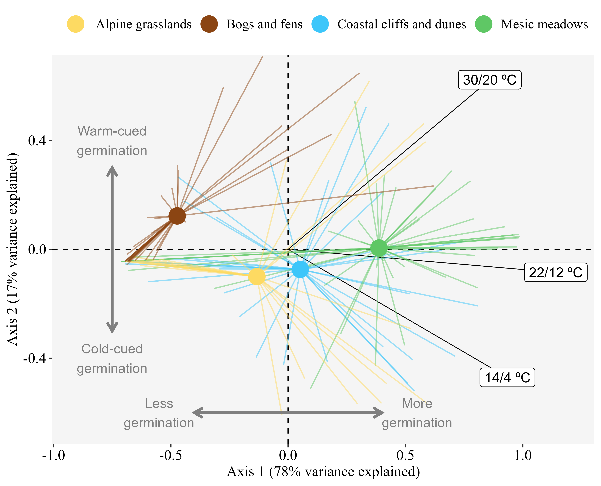

```{r setup, include=FALSE}
knitr::opts_chunk$set(echo = TRUE)
```

```{r message = FALSE, echo = FALSE, warning = FALSE}
library(tidyverse)
source("../src/numbers.R")
```

```{r message = FALSE, echo = FALSE, warning = FALSE}
knitr::knit_hooks$set(inline = function(x) {
  prettyNum(x, big.mark = ",")
})
```

Eduardo Fernández-Pascual^1^ ^+^, Madalena Vaz^2^, Beatriz Morais^1^, Ramón Reiné^3^, Joaquín Ascaso^3^, Elías Afif Khouri^1^, Angelino Carta^4^
 
^1^ Departamento de Biología de Organismos y Sistemas, Universidad de Oviedo, Oviedo/Uviéu, Spain; ^2^ Banco Português de Germoplasma Vegetal, Instituto Nacional de Investigação Agrária e Veterinária (INIAV), Braga, Portugal; ^3^ Departamento de Ciencias Agrarias y Medio Natural, Universidad de Zaragoza, Huesca, Spain; ^4^ Dipartimento di Biologia, Botany Unit, University of Pisa, Pisa, Italy

^+^ Correspondence: Departamento de Biología de Organismos y Sistemas, Universidad de Oviedo, C/ Catedrático Rodrigo Uría, 33006 Oviedo/Uviéu, Spain. Email: efernandezpascual@gmail.com. Telephone: +34985104787.

# Abstract

# Keywords

*Arrhenatheretalia*, *Arrhenatherion*, plant regeneration, seed germination, seed morphology, species-rich meadows, hay meadows, mesic grasslands

# Introduction

The mesic meadows of Europe are semi-natural open habitats that occupy moderately fertile and well-drained soils [@RN4698]. These plant communities developed in clearings of a temperate woodland landscape as a consequence of anthropogenic intervention [@RN5033; @RN5045]. At a time they were novel plant communities with a composite flora made up of species from different ecological backgrounds, and during historical times their species composition evolved following changes in human activities and management practices [@RN5035; @RN5045]. Mesic meadows are thus the result of a process of habitat domestication that is characteristic of Europe's natural history [@RN5034]. Nowadays, mesic meadows maintained by agricultural practices are an essential aspect of European landscapes, both real [@RN4996] and imagined [@RN5029].

Traditional classification of mesic grasslands puts emphasis on the separation between meadows used for hay making versus pastures maintained by grazing, but a recent revision at the European level showed that the main driver of variation in species composition is the intensity rather than the type of management [@RN4893]. Indeed, changes in the intensity of management, including land abandonment and agricultural intensification, are threatening the maintenance of mesic meadows in large parts of Europe [@RN4997]. For this reason, the European Habitats Directive (92/43/EEC) has included in its lists of habitats of conservation interest those species-rich meadows that are traditionally managed by one or two annual cuts and light grazing.

One of the reasons for the high conservation interest of traditional mesic meadows is their high species richness, and for this same reason they have been highlighted as a valuable source of natural seed materials to be used in ecological restoration, rewilding and urban greening [@RN5030; @RN4894; @RN5031]. However, a lack of knowledge about species germination traits has already been identified as a bottleneck [@RN2241] hampering the development of a competitive native seed industry [@RN4665] in Europe. Understanding seed germination is part of the practical scientific framework needed to tackle large-scale ecological restoration challenges [@RN3507] and to maintain *ex situ* collections of plant genetic resources [@RN3763]. When such a knowledge framework is available, ambitious regional schemes of seed-based landscape restoration can be designed [@RN4666].

Mesic meadows are dominated by mesophilous grasses of the family Poaceae, which make up most of the biomass and define the structure of the vegetation. The dispersal unit in Poaceae is generally the floret (**Fig. 1a**), a composite structure made up of the caryopsis or grain (a dry, indehiscent and monospermic fruit) and its surrounding bracts (i.e. modified leaves): the lemma and the palea. Removal of the lemma and palea, as well as puncturing the pericarp, can aid in seed germination [@RN1248]. The dispersal unit is often accompanied by awns or hairs (**Fig. 1b**) that are assumed to aid dispersal, although it is not always the case that they do [@RN1290]. Meadow Poaceae seeds have been reported as having physiological seed dormancy in various degrees [@RN5018; @RN3214; @RN5024], but germinability is usually high even without treating the seeds with cold stratification [@RN1205; @RN1260; @RN1271; @RN1229; @RN372; @RN789; @RN680; @RN1290; @RN398; @RN223; @RN334; @RN1281; @RN5024; @RN3273]. Freshly harvested seeds are comparatively more dormant, but dormancy tends to disappear quickly in dry storage [@RN5024; @RN5018]. Germination has been reported to occur at temperatures ranging from 5 to 30 ºC [@RN3273; @RN1229; @RN1261; @RN1230; @RN1292; @RN5024]. Most Poaceae species have also been reported to germinate better in light than in darkness [@RN1271; @RN1248; @RN1230; @RN1221; @RN1172; @RN1292; @RN1280; @RN5024] and even to be inhibited to germinate by darkness [@RN1229]. Nonetheless, species of *Bromus* have been reported as germinating better in darkness [@RN1172] and *Cynosurus cristatus* as being indifferent to light/darkness [@RN1292; @RN1280]. In *Poa trivialis*, germination was promoted by light but not by alternating temperatures [@RN1205], although alternating temperatures did encourage some germination in darkness [@RN1229]. Wild Poaceae ecotypes usually have a germination response to alternating temperatures [@RN1248; @RN1261; @RN1230; @RN1221; @RN1290; @RN1172; @RN1292; @RN1280], although this response is missing in some wild ecotypes and in the domesticated cultivars [@RN1261], and some species such as *Lolium perenne* have been reported as insensitive to temperature alternation [@RN1280; @RN1380].

Next in abundance to Poaceae are the legumes of the family Fabaceae. Fabaceae contribute to the nutritional value of meadow fodder, as thanks to their N-fixating capabilities they have high N contents [@RN5028; @RN5040]. The dispersal unit of most Fabaceae is the seed itself (**Fig. 1c**) but in some species dispersal units are more complex, including indehiscent monospermic fruits (e.g. *Onobrychis*, **Fig. 1d**) or indehiscent monospermic fruit fragments, i.e. loments (e.g. *Ornithopus*, **Fig. 1e**). Fabaceae are generally hard-seeded, i.e. they have a water-impermeable seed coat which needs to become permeable before germination can happen (i.e. physical seed dormancy) [@RN3214; @RN3273; @RN1215; @RN5016; @RN3073]. In *Medicago*, seeds that have not reached full maturity can germinate before they become impermeable, but the completion of maturation imposes coat impermeability, and thereafter the seed must be scarified to allow water imbibition and germination [@RN652]. Buried Fabaceae seeds are able to track the seasons, and in some species germination seems to be promoted by cold stratification and alternating temperatures [@RN780]; some of these species have been described as having combinational dormancy (i.e. physical + physiological) [@RN5037]. However, Fabaceae seeds have also been reported to germinate without any previous treatment [@RN881; @RN632; @RN460; @RN372], and to lose dormancy during storage [@RN5037]. As in Poaceae, seeds of Fabaceae have been reported to germinate in high numbers across a range of temperatures from 5 to 25 ºC [@RN652; @RN3273]. Fabaceae seeds have been described as not responsive to light and capable of germinating in darkness [@RN1339; @RN3273].

Poaceae and Fabaceae are accompanied by a diversity of other families which, even if present in lower abundances, contribute to the aesthetic value of the meadows [@RN5038; @RN5039]. They also add nutritional scope, being richer than Poaceae and Fabaceae in specific elements [@RN5028; @RN5040]. In many of these families (e.g. Asteraceae, Cyperaceae, Dipsacaceae, Lamiaceae, Polygonaceae, Ranunculaceae) the dispersal unit is the achene: dry, indehiscent and monospermic fruits. The morphology of these achenes is varied: cypselae with a hairy pappus in *Centaurea* (Asteraceae, **Fig. 1f**); beaked in *Ranunculus* (Ranunculaceae, **Fig. 1g**); hardened nutlets in *Prunella* (Lamiaceae, **Fig. 1h**); hairy in *Knautia* (Dipsacaceae, **Fig. 1i**); surrounded by a perigynium which aids in dispersal by water in *Carex* (Cyperaceae, **Fig. 1j**). In the genus *Sanguisorba* (Rosaceae), the dispersal unit is the urn-shaped receptacle containing one to three achenes (**Fig. 1k**). In Apiaceae, it is the mericarp (**Fig. 1l**), an indehiscent monospermic fragment of the fruit. In some other minor families the dispersal unit is the seed itself, such as in Caryophyllaceae (**Fig. 1m**), Plantaginaceae (**Fig. 1n**), Juncaceae or the hemiparasitic species of *Rhinanthus* (Orobanchaceae) (**Fig. 1o**). In Asteraceae, high germination without pretreatments has been reported in *Taraxacum officinale* [@RN1276; @RN194; @RN120; @RN963; @RN1428], *Hypochaeris radicata* [@RN194; @RN1403] and *Achillea millefolium* [@RN1403]. *Taraxacum officinale* germinates between 5 and 30 ºC [@RN120; RN1428; @RN1276], and has higher germination in light [@RN1015; @RN963; @RN1172] and in alternating temperatures [@RN1428]. In *Stachys officinalis* (Lamiaceae), seeds need either cold stratification, light or alternating temperatures to germinate [@RN416; @RN128]. Underdeveloped embryos that need to grow inside the seed before germination (i.e. morphological dormancy) are widespread in Ranunculaceae and Apiaceae [@RN3214; @RN1112]. *Ranunculus repens* (Ranunculaceae) germinates between 10 and 25 ºC, but the germination percentages were reported to be low [@RN931]; the same species has been reported to respond to alternating temperatures, which can promote its germination even in darkness [@RN3180]. In Polygonaceae, *Rumex acetosa* can germinate immediately after dispersal and between 7 and 27 ºC, while the congeneric *Rumex acetosella* does not, this difference is due to the former being able to germinate at constant temperatures in the darkness [@RN814; @RN3273], while the latter has an absolute requirement for light [@RN814]. In *Heracleum sphondylium* (Apiaceae), growth of the embryo only occurs below 10 ºC, in moist conditions [@RN1112]. *Sanguisorba minor* (Rosaceae) increases its germination after abrasion of the seeds with bleach [@RN194; @RN226], although germination without pre-treatment has also been reported [@RN298; @RN226]. Seeds of the hemiparasitic species *Rhinanthus angustifolius* and *Rhinanthus minor* (Orobanchaceae) require relatively long periods of cold stratification to germinate [@RN4014], and are able to germinate in the dark [@RN2236].

Although a wealth of studies has accumulated, a synthesis of seed ecology in European mesic meadows is missing. In this article, we review for the first time this topic, combining newly-generated data on seed morphology and germination with records from existing databases [@RN5036; @RN4968; @RN2987; @RN2319]. The resulting dataset contains `r MSrecords` germination records of `r MSspeciesN` plant species from `r MScountries` European countries. To test the seed germination response to environmental cues including scarification, stratification, temperature, alternating temperature and light we apply Bayesian meta-analysis [@RN5000]. Further, using well-preserved meadows of the Iberian Peninsula as a study system, we analyze the covariation between seed traits and species environmental preferences, and compare the germination ecology of mesic meadows with that of other herbaceous plant communities from the same area.

# Materials and methods

## Selection of mesic meadow species

To create a list of representative mesic meadow species for inclusion in our analysis, we used a dataset comprising 118 vegetation relevés (i.e. records of plants species co-occurring in sampling plots) from three Western European regions with well-maintained mesic meadows: 43 relevés from Northern Portugal, 25 from the Cantabrian Mountains of Spain and 50 from the Pyrenees. These relevés contain a sample of mesic meadow diversity, as they were recorded along a major stress gradient related to summer drought [@RN2980]: the Pyrenees and Cantabrian Mountains have a temperate macroclimate, whereas Northern Portugal is transitional between the temperate and Mediterranean macroclimates. Furthermore, meadows from the Pyrenees are closest to the European optimum of mesic meadow vegetation while the Portuguese ones are in suboptimal areas at the limit of the European distribution of temperate meadows [@RN4893]. Finally, the traditional management of meadows is relatively well preserved in these three regions compared to their European context [@RN4998; @RN4999].

Study meadows had been maintained by traditional agricultural practices: mowing for hay-making once or twice per year plus light grazing. Each vegetation sampling plot was placed in a square area (25-100 m^2^ area) situated in the central part of a meadow, avoiding the margins. Vegetation sampling took place in 2016-2017, at the peak of plant development, just before mowing. All vascular plant species in the plots were recorded and given a cover value using the transformation of the Braun-Blanquet scale to coverage (+ = 0.1%, 1 = 5%, 2 = 17.5%, 3 = 37.5%, 4 = 62.5% and 5 = 87.5%). All plant names were assigned following the nomenclature of Euro+Med [-@RN5044], which is used throughout this article. As expected, the vegetation of the sampled meadows was dominated by Poaceae and Fabaceae: these two families represented 47% and 17%, respectively, of the total plant cover recorded in all the plots. Other 20 families were recorded, the largest of which was Asteraceae; each of these other families represented less than 10% of the total cover.

Using all the relevés, we calculated the cumulative cover of each species in the entire area. To perform the calculation, first we standardized the cover values of the plots by dividing the cover of each species in each plot by the total plant cover in that plot. Then, for each species, we calculated its total cover in the dataset, by summing its standardized cover values from all the plots. Finally, we rescaled the values of all species to a 1-100 scale to obtain the cumulative cover values. We removed 208 species with cumulative cover values below 2%, considering them to be rare species that might have been recorded by chance and may not represent the core mesic meadows flora. We used the remaining 116 species as the core list to retrieve seed germination data for this article. The majority of these species were hemicryptophytes (78%), with some therophytes (16%) and a few chamaephytes and geophytes (3% of each). The family with more species in the list was Poaceae (22%), with another 17% belonging to Fabaceae, 15% to Asteraceae, 8% to Apiaceae, and the rest of the families representing less than 5% each.

We also used the relevés as a basis to characterize the preferences of the selected species for three ecological drivers of mesic meadow diversity: cold, summer drought and soil reaction [@RN2980]. For cold and drought, we used the coordinates of the plots to retrieve from CHELSA [@RN4766] the bioclimatic variables bio06 (minimum temperature of the coldest month) and bio14 (precipitation of the driest month). For soil reaction, we took from each plot five soil samples from between 0 and 20 cm depth with a Dutch auger and combined them to make a bulk soil horizon, which we subsequently air-dried, crumbled, finely crushed and sieved with a 2 mm screen, to finally measure the pH in H~2~O with a glass electrode in a suspension of soil and water (1:2.5). For each of these three environmental variables (bio06, bio14, pH) measured at the plot level we calculated the species niche centroids (SNCs). The SNC for any given species and variable is the mean of the environmental variable in all the plots were the species occurs, weighted by species cover in each plot [@RN4709]. The list of core species, with their cumulative covers and SNCs, is available at GitHub (see Data Availability Statement). 

## Seed morphology and germination dataset

From the vegetation plots described above, we collected dispersal units (hereafter called seeds) during the dispersal seasons of 2016, 2017 and 2018. Seed collection followed the methodology of ENSCONET [-@RN2907]. To describe seed morphology, we acquired images of 100-seed samples of each species using a flatbed scanner (Brother LC985) with a resolution of 200 dpi and a scanning area of 1024 x 1024 pixels [@RN2678]. We distributed the seeds on the transparent glass of the scanner, in a 10 x 10 grid. For each sample, and without moving the seeds, we repeated the scans with black and white backgrounds. In the case of the black background, we covered samples with a black box to avoid interference from environmental light. For the white background, we used the scanner cover. We digitized the obtained images and stored them in JPEG format (Joint Photographic Experts Group). We processed the scanned images using *ImageJ*, an open-source image processing program designed for scientific multidimensional images [@RN4708]. The program calculates several biometric parameters for each seed on the sample, and among these we choose seed length and width. Additionally, we retrieved species values of seed mass from the Seed Information Database [@RN2987] and of seed number at the individual/ramet level from the LEDA database [@RN2319]. The dataset with the length and width measures is available at GitHub (see Data Availability Statement). 

We germinated the collected seeds using three germination treatments to determine the germination response to temperatures that are representative of the study area: 14/4 ºC representing the capacity of freshly-dispersed seeds to germinate at cool temperatures of spring and autumn, 22/12 ºC as the summer temperature, and 30/20 ºC as sun-heated soil, e.g. soil exposed to sun after hay cutting. Additionally, we compared, at each of these temperature regimes, the germination of fresh seeds versus seeds subjected to a dormancy-breaking treatment. In the case of Fabaceae and other families that might present physical dormancy [@RN3214], the treatment consisted in scarification by chipping the seed coat with a scalpel. For the rest of the families, we used gibberellic acid GA~3~ (0.0645 mM) in darkness during 24h, as a treatment to remove potential physiological seed dormancy [@RN4976]. For each species and treatment, we sowed four Petri dishes with 25 seeds each. The germination substrate was 1% distilled water - agar. We sealed dishes with Parafilm to prevent desiccation. Trials took place in a germination chamber (KBW 400, Binder GmbH, Tuttlingen, Germany) with a 12/12-hour photoperiod (the light period corresponding to the higher temperature). Experiments lasted for four weeks, with germination scoring once per week. The germination criterion was 2 mm radicle emergence. After four weeks, we cut the seeds that failed to germinate and examined them under a magnifying glass. We classified them as normal when the embryo was visible and firm, empty when they lacked an embryo, and contaminated when they were moldy. We only considered normal seeds to calculate germination proportions and conduct subsequent analyses.

In addition to this experimental data, we retrieved seed germination records from ENSCOBASE [@RN5036], the seed germination database of the European Native Seed Conservation Network (http://enscobase.maich.gr/index.tml); and the *SylvanSeeds* database of seed germination records for the nemoral biome [@RN4968]. The combined dataset, including our own experimental data and the records from ENSCOBASE and *SylvanSeeds*, contained `r MSrecords` germination records (i.e. germination proportions for a given seed lot of a species, recorded in a set of laboratory experimental conditions) from `r MScountries` European countries. There were `r MSspeciesN` species in the dataset (i.e. 90% of the core list of meadow species was covered). Overall, `r MSseedsN` seeds had been used in the experiments. The range of experimental germination temperatures (weighted average of the daily thermoperiod) which had been used in the experiments spanned from `r MSminT` to `r MSmaxT` ºC, with `r MSaltN` records of constant temperatures (i.e. experiments that used the same temperature during all their duration) and `r MSaltY` of alternating temperatures (i.e. experiments where different temperatures were applied during the day and the night, in diurnal cycles). Seeds had been exposed to light during some part of the diurnal cycle in `r MSlightY` records or kept in total darkness in `r MSlightN` records. Experiments had been performed with unstratified seeds (i.e. not subjected to a previous dormancy-breaking incubation) in `r MSstratN` records and with stratified seeds (i.e. subjected to previous incubation in dormancy-breaking conditions, including treatments of wet incubation under cold, warm and combinations of cold and warm conditions) in `r MSstratY` records. Finally, there were `r MSgaY` records where GA~3~ had been applied, and `r MSscarY` records where seeds had been scarified. The full germination dataset is available at GitHub (see Data Availability Statement). 

## Statistical analysis

We conducted all analyses in R [@RN2315], and the code for analysis and creation of the figures and manuscript is available at GitHub (see Data Availability Statement)

To test the effect of germination cues on seed germination proportions, we performed a meta-analysis [@RN5000] of the germination dataset by fitting binomial generalized mixed models with Bayesian estimation (Markov Chain Monte Carlo generalized linear mixed models, MCMCglmms) [@RN5036; @RN4965] using the R package *MCMCglmm* [@RN4755]. We fitted models to the entire dataset, and also separately for each of the three botanical groups of mesic meadows: Poaceae, Fabaceae, and the other families. To account for the effect of a shared phylogeny in species traits, models included as a random effect a reconstructed phylogenetic tree for the study species. To create the phylogeny, we used the R package *V.PhyloMaker* [@RN4753] which contains an updated mega-tree of the seed plants based on Smith & Brown [-@RN4754]. We placed taxa absent from the mega-tree at the genus-level basal node. The phylogenetic tree is available at GitHub (see Data Availability Statement). Germination proportion was the response variable. Models had, as fixed effects, the experimental conditions (scarification, stratification, GA~3~, temperature, alternating temperature and light). Random effects included the phylogenetic tree, species identity, seed lot and source of the data. In all models, response variables were scaled so their contribution to the effect sizes could be compared. We used weakly informative priors in all models, with parameter-expanded priors for the random effects. Each model was run for 500,000 MCMC steps, with an initial burn-in phase of 50,000 and a thinning interval of 50 [@RN4756], resulting, on average, in 9,000 posterior distributions. From the resulting posterior distributions, we calculated mean parameter estimates and 95% Highest Posterior Density (HPD) and Credible Intervals (CI). We estimated the significance of model parameters by examining CIs, considering parameters with CIs overlapping with zero as non-significant. To estimate the phylogenetic signal of seed germination over all variables, we used Pagels’s lambda (λ) [@RN4757], estimated simultaneously with the models by calculating the mean of the posterior distribution and the 95% CI of λ as indicated by De Villemereuil et al. [-@RN4756]. When λ = 0, related taxa are no more similar than expected by chance, while when λ = 1, the trait is evolving following a constant variance random walk or Brownian motion model; intermediate values of λ indicate a phylogenetic correlation in trait evolution that does not fully follow a Brownian motion model [@RN4757]. Detailed results of the MCMCglmms are available at GitHub (see Data Availability Statement).

To check whether seed traits and plant ecological preferences were related, we did a Principal Component Analysis (PCA) of seed traits and species SNCs for cold, drought and pH. We performed the PCA ordination at the species level, i.e. calculating a series of continuous seed traits for each species. We transformed the final germination proportions to create a continuous variable for the germination cues (i.e. stratification, scarification, temperature, alternating temperatures and light). To do so, for each cue and species, we calculated a weighted average of the cue levels (in the case of temperature, cue levels were the temperature treatments; for the other cues the levels were 0 = absence and 1 = presence), weighting by the germination proportion at each level. This approach underrepresents the importance of the levels that were not tested for a given species, but can serve as a proxy of the response to the germination cues when visualized across the whole dataset. We also included seed mass and seed number in the ordination. We left GA~3~ out of the PCA because its ecological interpretation is subordinated to stratification (as both cues break physiological seed dormancy). We also left seed length and width out because these values were not available for enough species. We calculated the PCA with the package *FactoMineR* [@RN3166].

Finally, to compare the germination of mesic meadow species with other herbaceous communities, we retrieved data from previous works on the seed germination ecology of bogs and fens [@RN3480; @RN3212], alpine and subalpine grasslands [@RN2371], and coastal plant communities of rocky cliffs and sand dunes [@RN2865]. These additional germination records corresponded to the same experimental methodology as the one employed for some of the germination experiments of this study: recently-collected seeds, untreated for physiological dormancy (but scarified in the cases of families known of having physical dormancy), had been subjected to three germination thermoperiods (14/4 ºC, 22/12 ºC, 30/20 ºC) in the same conditions as described previously. All seeds had been collected in the Cantabrian Mountains of Spain and the neighboring coast. We added these records and the records with matching experimental conditions from the meadows germination dataset, and performed a PCA of the resulting dataset. The germination records for the other plant communities are available at GitHub (see Data Availability Statement).

# Results

## Seed morphology

Poaceae had lower values of seed mass and higher values of seed number, while Fabaceae had heavier but fewer seeds (**Fig. 2**). The other families covered the range of values showed by Poaceae and Fabaceae, but their median values were high for both traits: their median seed mass was close to that of the Fabaceae, while their median seed number was higher than that of the Poaceae (**Fig. 2**). Seed shape also showed a divergence between Poaceae and Fabaceae, with seeds being elongated in the former and rounder in the latter (**Fig. 2**). The other families covered the full range of variation, with both elongated and round seeds (**Fig. 2**).

## Seed germination

When considering the full set of mesic meadow species, all of the six studied germination cues had a significant effect on final germination proportions (**Fig. 3**). The germination of meadow seeds was positively associated with scarification, stratification, GA~3~, alternating temperatures, and light. Average temperature had a negative effect, indicating a trend towards higher germination at lower temperatures. Averaging the whole dataset, the highest germination proportions were achieved at 20 ºC. Between 0 ºC and 20 ºC, germination proportions increased steadily with increasing temperatures. Above 20 ºC, germination declined more sharply, and meadow seeds rarely germinated at 30 ºC.

Some differences became apparent when dividing the dataset in the three floristic groups that compose mesic meadow vegetation. In Poaceae (**Fig. 3**), no effect was found for stratification, GA~3~ or temperature. Stratification had a negative effect on germination. The major drivers of Poaceae germination appeared to be alternating temperatures and light, with both having a positive effect. In Fabaceae (**Fig. 3**), the largest positive effect on germination was produced by scarification, with no effect of stratification, GA~3~ or light. Temperature had a negative effect, and in fact Fabaceae species had higher germination proportion at temperatures under 20 ºC. Fabaceae seed germination also responded negatively to alternating temperatures. Finally, in the remaining families (**Fig. 3**), the main cues having a positive effect on germination were stratification, GA~3~, alternating temperatures and light. These species did not respond to scarification nor to average temperature.

To describe the effects of the random factors, we will refer only to the full model that included all species in the dataset. The strongest effect was that of the phylogeny (mean = `r MSphylo`, CI = `r MSphylol` - `r MSphyloh`), followed by the source of the data (mean = `r MSsource`, CI = `r MSsourcel` - `r MSsourceh`) and the seed lot (mean = `r MSpopulation`, CI = `r MSpopulationl` - `r MSpopulationh`). The phylogenetic signal in the germination responses was relatively high (lambda = `r MSlambda`, CI = `r MSlambdal` - `r MSlambdah`).

## Seed traits and ecological preferences

PCA indicated a clear separation between environmental preferences and seed traits, with each set of variables contributing to different axes (**Fig. 4**). The first PCA axis explained `r round(pca$eig[1, 2], 0)`% of the variation and was related to environmental preferences. The variables with the largest contribution to this first axis were soil reaction (pH), winter cold (bio06) and summer drought (bio14). This horizontal axis separated (i, left) species with preferences for sites with warm winter temperatures from (ii, right) species with preferences for sites with high summer rainfall and alkaline soils. Axis 2 explained `r round(pca$eig[2, 2], 0)`% of the variability, mostly related to seed traits. The main contributing variables were seed mass, seed number and the germination response to scarification. This axis separated (iii, bottom) Poaceae species that produced many seeds with a positive germination response to alternating temperatures from (iv, top) Fabaceae species that produced heavier seeds with a positive response to scarification.

## Comparison with other habitats

Ordination resulted in a separation of mesic meadow species from species belonging to natural herbaceous communities of the same region (**Fig. 5**). Axis 1 explained 78% of the variance and was positively associated to high germination at all three temperature treatments. This horizontal axis separated (i, left) species with low germination across treatments from (ii, right) species with high germinability across treatments. The second axis explained 17% of the variation and separated (iii, bottom) species that responded more to the cool temperature germination treatment from (iv, top) species that responded more positively to the warm germination treatment. Meadow species tended to be situated in the right sector of the ordination, indicating high germinability; and at the center of the vertical axis, indicating a neutral response to temperature. On the other hand, species from the other communities were positioned at the left of the horizontal axis, indicating a lower germinability; and were more separated along the vertical axis, indicating a preference for either warmer (bogs and fens) or cooler (alpine grasslands, coastal communities) germination treatments.

# Discussion

Our meta-analysis of germination records showed that, overall, the regeneration of mesic meadows is characterized by (1) high germinability when compared to other herbaceous plant communities; (2) low correspondence between seed trait variability and the natural environmental drivers of mesic meadow diversity; and (3) a strong phylogenetic separation between the two major families, Poaceae and Fabaceae. 

We found that alternating temperatures and light are the two most influential factors triggering germination, especially in species from the family Poaceae and the remaining ones, with the exception of Fabaceae. Alternating temperatures and light are usually considered to be micro-environmental cues that indicate, at a fine scale, the existence of safe sites for regeneration [@RN4719]. The diurnal alternation of temperatures decreases with burial depth in the soil, and the alternation is also reduced by vegetation cover [@RN1380; @RN4910; @RN4952]. Thus, a positive germination response to alternating temperatures could detect the depth of seed burial, and prevent the germination of seeds that are buried too deep for seedlings to survive before emerging from the ground [@RN4898]. Perhaps more importantly in this habitat, alternating temperatures could also indicate that the vegetation cover has been diminished by either sowing or grazing, and therefore mark an appropriate time for seedling regeneration, when the competition by the established plants is lessened. Similar functions can be ascribed to the germination response to light, as physiologically-active light in significant amounts only travels the uppermost milliliters of soil [@RN4909] and the quality of light will be affected by vegetation cover [@RN604]. Therefore, the germination response to alternating temperatures and light indicate conditions that are found immediately after mowing for haymaking, a predictable perturbation that occurs approximately at the same time every year, and which forces meadow plants to establish, grow and reproduce in the time frame determined by this perturbation [@RN4887; @RN4888]. In addition, these traits would also promote the formation of a persistent soil seed bank [@RN4718; @RN4929; @RN1292]. On the other hand, it is worth mentioning that Poaceae, which show the germination response to alternating temperatures and light, also have the more elongated seed shape, a trait that is thought to reduce the capacity of seeds to enter the soil seed bank in temperate meadows [@RN5014; @RN5013].

The strong effect of scarification was specifically related to the hard-seeded Fabaceae. In this family, physical dormancy as a result of an impermeable seed coat works as a mechanism to detect seasonal cycles of temperature and humidity [@RN780]. It has been also proposed that hardseedness can avoid seed predation, by preventing the emission of olfactory cues that are elicited by seed imbibition and that can be perceived by seed predators [@RN2568]. In the case of this study, Fabaceae seeds are amongst the heaviest, and they clearly follow a separate regeneration strategy from that of the other families. While other groups rely on alternating temperatures and light as gap-detecting mechanisms, Fabaceae seeds do not respond to these factors, and instead they are mainly regulated by scarification, and they also respond to cooler temperatures than the rest of species. This would indicate that Fabaceae seeds tend to germinate when temperatures are cooler, and thus before or after the summer hay-making season. Their larger size, and the related larger reserves, could allow Fabaceae seedlings to emerge at times when the competition from the established vegetation would be higher.

The germination response to average temperatures and stratification is understood to detect cues related to seasonal cycling and macroclimatic variation [@RN3063; @RN5036]. Apart from the aforementioned response to cool temperatures in Fabaceae, the rest of the families did not show a response to average temperatures, further highlighting their reliance on micro-habitat cueing. Moreover, the dominant family Poaceae showed a negative response to cold stratification. The less frequent families, however, showed a divergence from the Poaceae strategy in their positive response to stratification. These non-dominant species appear to require a period of cold stratification, indicating that overwintering has occurred, before they can germinate [@RN3214]. These minor families are also the only group of species that showed a positive response to GA~3~, a phytohormone which can work as a substitute of cold stratification to overcome physiological dormancy [@RN3368].

The positive phylogenetic signal found in the models highlights the phylogenetic clustering of regeneration strategies that we have described so far: (1) the dominant family Poaceae, showing a lack of responses to seasonal cues (average temperature and cold stratification), and relying instead on large amounts of propagules and on detecting micro-niche cues (alternating temperatures, light) that can be associated to the yearly perturbation of mowing, (2) the second most-dominant family, Fabaceae, which do not respond to the micro-niche cues, and regulate their germination timing through scarification and cooler germination temperatures, possibly because their larger size and reserves allow their seeds to decouple their emergence timing from the mowing disturbance, and finally (3) the minor families that respond to micro-cues in a similar way than Poaceae, but which are differentiated from them by showing a positive response to cold stratification and G~3~, indicating that they rely on physiological seed dormancy. This third strategy would allow to fine-tune their germination with the local environmental conditions and the inter-annual climatic variation. Phylogenetic clustering is also apparent regarding seed shape, mass and number, with Poaceae producing many elongated and light seeds, and Fabaceae producing fewer, rounder and heavier seeds. The shape of the Poaceae seeds could make them particularly successful in being dispersed attached to hay, and Poaceae seeds tend to be overrepresented in seed mixes obtained via hay-making [@RN5046; @RN4894]. Asteraceae and Apiaceae, some of the most abundant among the minor families, also tend to have shapes resembling those of Poaceae.

As we have seen, this regeneration strategy of high germinability appears to be unrelated to environmental patterns in hay meadows, and seems more adapted to the predictable perturbation that is yearly mowing. In an abandoned meadow of the Prealps, resuming mowing promoted germination and emergence, although natural regeneration was limited due to a lack of seed dispersal to the site [@RN3073]. Mowing also promoted autumn germination in a dry grassland of northern Germany [@RN5025]. These results agree with the lack of dormancy and the high germinability of meadows seeds that we have found, and which has also been highlighted by previous studies. For example, when comparing populations of *Poa trivialis*, grassland seeds were less dormant than seeds collected in an arable field [@RN1229]. Ten Brink et al. [-@RN3570], when comparing congeneric herbaceous species from open and forest habitats found that species from open habitats needed less cold stratification. Similarly, seeds collected from a hay meadow germinated better when left untreated, rather than when being exposed to dormancy-breaking treatments [@RN4894]. These high-germinability strategy has the consequence of greatly limiting the long-term seed bank of mesic meadows. Rather, the soil bank is transient in hay meadows and related grasslands [@RN5026; @RN5041; @RN5042]. In Poland, the soil bank of a hay meadow was dominated by forbs of arable and weedy species, with low representation of Poaceae and Fabaceae [@RN5032]. 

Overall, this indicated that mesic meadows are quite sensitive to land use change, and their inability to form seed banks leads to the known dispersal limitation to natural regeneration [@RN3073], highlighting the importance of active actions of meadow restoration via seed supply. Human activities have shaped the regeneration of hay meadows, leading to a loss of seed dormancy and seasonal tracking, as has been found in many domesticated species [@RN4315]. The same anthropic processes that have shaped semi-natural mesic meadows have left them dependent on continued human intervention for their regeneration. Understanding the germination requirements of the different plant groups that coexist in mesic meadows can help to manage, conserve and restore their biological diversity.

# Acknowledgements

E.F.P. received financial support from the Government of Asturias and the FP7 – Marie Curie - COFUND programme of the European Commission (Grant ‘Clarín’ ACB17-19). This research was supported by project Interreg SUDOE “SOS PRADERAS” SOE1/P5/E037 (https://www.sospraderas.eu/en/).

# Author contributions

All authors contributed data. E.F.P. conceived the study and performed the analyses. E.F.P. wrote the manuscript with help from A.C. All authors revised the manuscript, and approved the final version.

# Data availability

The original data, R code for the analysis and creation of the manuscript can be accessed at the GitHub repository https://github.com/efernandezpascual/meadows. Upon publication, a version of record of the repository will be deposited in Zenodo.

# References

::: {#refs}
:::

# Figures

```{r fig1, echo = FALSE, fig.pos = "H", fig.cap = "Diversity of dispersal units in plant species from mesic meadows: (a) Floret of *Cynosurus cristatus* (Poaceae); (b) floret of *Arrhenatherum elatius* (Poaceae); (c) seed of *Lathyrus pratensis* (Fabaceae); (d) legume of *Onobrychis viciifolia* (Fabaceae); (e) loment fragment of *Ornithopus perpusillus* (Fabaceae); (f) achene with pappus of *Centaurea scabiosa* (Asteraceae); (g) achene of *Ranunculus acris* (Ranunculaceae); (h) nutlet of *Prunella grandiflora* (Lamiaceae); (i) achene of *Knautia nevadensis* (Dipsacaceae); (j) perigynium of *Carex binervis* (Cyperaceae); (k) receptacle of *Sanguisorba minor* (Rosaceae); (l) mericarp of *Carum verticillatum* (Apiaceae); (m) seed of *Cerastium fontanum* (Caryophyllaceae); (n) seed of *Plantago lanceolata* (Plantaginaceae); (o) seed of *Rhinanthus angustifolius* (Orobanchaceae)."}

```

```{r fig2, echo = FALSE, fig.pos = "H", fig.cap = "Morphology of mesic meadow seeds. The two panels on the left show the probability densities of species values for seed mass and seed number, log-transformed for ease of visualization. The three horizontal lines within the probability densities represent the first quartile, the median and the third quartile of the values. The panel on the right shows values of seed length and width obtained by image analysis, with each point being a seed. In all cases, data is divided between the grasses (Poaceae), legumes (Fabaceae) and the other plant families."}

```

```{r fig3, echo = FALSE, fig.pos = "H", fig.cap = "Germination cues in mesic meadows. Effect of germination cues simulated in the laboratory over the final germination proportions of mesic meadow seeds. Dots indicate the posterior mean of the effect size for each cue, and whiskers the 95% credible interval of the effect size. The line of zero-effect is shown: when a credible interval overlaps with the zero-effect line, the effect can be regarded as non-significant. In separate panels, the figure shows the results of a general model including data for all species, plus specific models for the three main botanical groups of mesic meadows: grasses (Poaceae), legumes (Fabaceae) and the other families."}

```

```{r fig4, echo = FALSE, fig.pos = "H", fig.cap = "Environment and seed traits are separate axis of variation in mesic meadows. Principal Component Analysis ordination of mesic meadow species considering their environmental preferences and their seed traits. Each point is a species, colored by the three main botanical groups of mesic meadows: grasses (Poaceae), legumes (Fabaceae) and the other families. Labels indicate the contribution of the variables to the axes: grey-background labels for environmental preferences, and white-background labels for seed traits. Environmental preferences were calculated as species niche centroids (SNCs) for the minimal temperature of the coldest month (bio06), precipitation of the driest month (bio14), and soil pH. To calculate the SNCs, a vegetation dataset of mesic meadows of the Iberian Peninsula was used. The seed traits are seed mass and the germination relative indices for the response to scarification, stratification, average germination temperature (temperature), alternating temperature (alternating) and light. All environmental preferences were aligned to the first axis, while the seed traits were aligned to the second axis, showing that environment and seed traits are separate axis of variation in mesic meadows. Stratification and average germination temperatire showed very low variation, in accordance with their small effect on Figure 2."}
knitr::include_graphics("../results/figures/Fig4.png")
```

```{r fig5, echo = FALSE, fig.pos = "H", fig.cap = "Higher germinability in mesic meadows compared to other herbaceous plant communities. Principal Component Analysis ordination of species responses to three seed germination treatments. Species are grouped by their habitat, with points showing the centroid for each habitat group, and rays linking the centroid with the position of each species in the group. Labels indicate the contribution of the germination treatments to the axes. All species had been collected in herbaceous vegetation types of the Cantabrian Mountains of Spain and the neighboring coast. All seeds were recently collected and untreated, except for scarification, which was applied routinely to all botanical families presenting it. Germination treatments consisted in 12/12 h periods with a warmer phase in light and a cooler phase in darkness. The position of mesic meadows compared to the other habitats indicates that their species tended to have higher germinability even if untreated (i.e. less seed dormancy) and were more neutral in their thermal requirements."}

```
